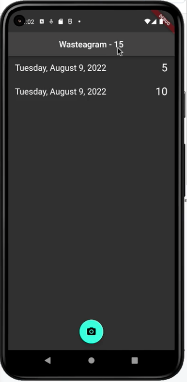
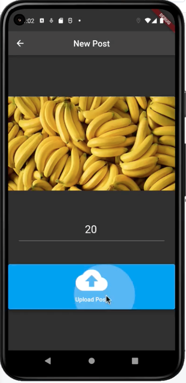
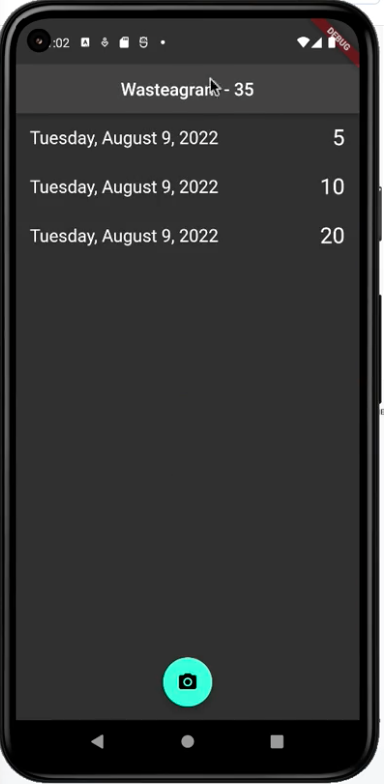
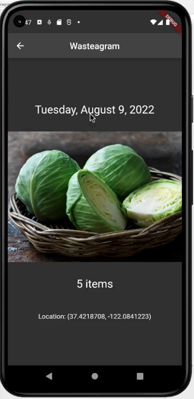

# Food-Waste-FlutterApp

## Overview
- This application enables a user to document daily food waste, consisting of a photo, number of leftover items, current date and location of item(device).
- This projects has the objective to showcase several mobile/flutter features implemented in the application. 
    - Invoke asynchronous methods, employ navigation, capture form data, and display data in ListView components and detail screens.
    - Demonstrate persistence with remote storage services, such as Firebase Cloud Storage and a Firestore database.
    - Obtain device location information and integrate the use of the camera or photo gallery.
    - Implement unit tests to validate application behavior.
    - Incorporate the Semantics widget to facilitate accessibility features of native platforms.
    - Demonstrate the use of analytics, crash reporting, and debugging tools. 

## Application Usage
### Main Screen 
- User is able to see list of posts uploaded in application. 
- Number of total leftover items is shown on the top part of the screen. 
- User selects option(camera button) to make a new post.

    
### New Post Screen
- User selects image from camera or library, adds number of leftover items and sumbmits the post.

### Main Screen Updated
- User is able to see the new post included in the main screen.
- User selects the first post in the list.

### Post Detail Screen
- User is able to see the details of the selected post:
    - Date
    - Image of leftover items
    - Amount of leftover items
    - Location of leftover items

